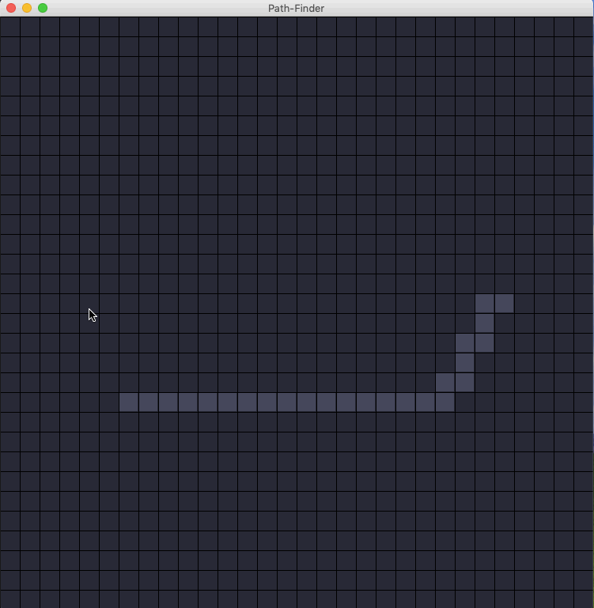

# left-or-right
A Java GUI app to help you find your way with a little help from Mr Dijkstra and Mr Someone who invented A-Star. 

## Program Demo

## Running locally
Make sure your have JDK 1.8+ installed on you system and Classpath variable pointing to the correct directory.
* `Download the source code or clone the repo`
* `Compile all the three files in the src folder : javac Controller.java, javac Pathfinder.java, javac Node.java`
* `Run Controller : java Controller`

## Steps:

The main steps involved are : 
1. Select a start node
2. Select an end node 
3. Add walls wherever you like.
4. Select Pathfinding algorithm : Dijkstra or A-star.
5. Run the algorithm.
6. Clear the grid, undo an operation(unselect a start/end/wall node).

##The main controls are :
Press( do not hold) 's' and click anywhere on the grid to create a start node.

Press 'e' and click anywhere on the grid to create an end node.

Press 'c' to clear the grid or start over.

Press 'backspace' to completely clear the grid while keeping start/end node

Press 'd' and click on the specific node the user wants to delete.

Press '1' to use the Dijkstra pathfinding

Press '2' to use the A-Star pathfinding

Press 'spacebar' to run the algorithm.

#Misc Information
*This was an academic project which I built with some( a lot, in fact) help from the main project here :
https://github.com/lootrr/PathFinder-Visualization

*The cost of path and other data is displayed on the console.*

*You can create complex mazes by adding wall nodes and put Dijkstra(or A-star) in some trouble.*

*The A-star algorithm uses heuristic cost to find the min cost path. Consider this page for a better understanding.*
http://theory.stanford.edu/~amitp/GameProgramming/Heuristics.html#S7 

#For Queries/doubts/help
Forward your queries to **prabhat25199@gmail.com **

